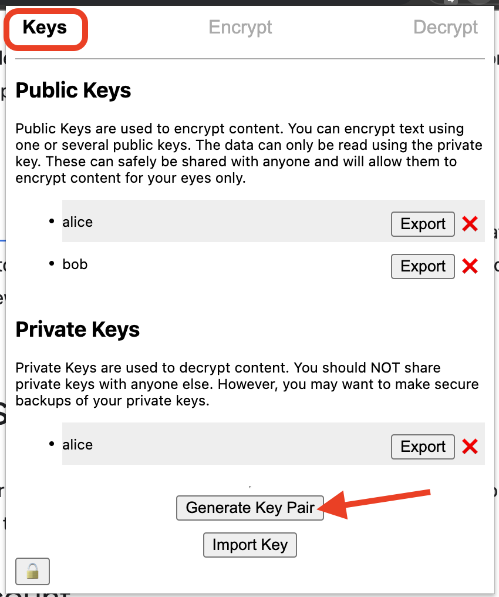
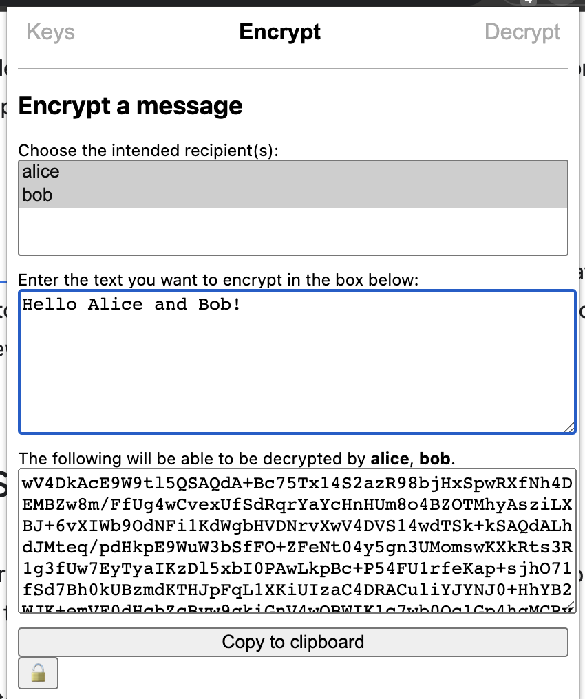
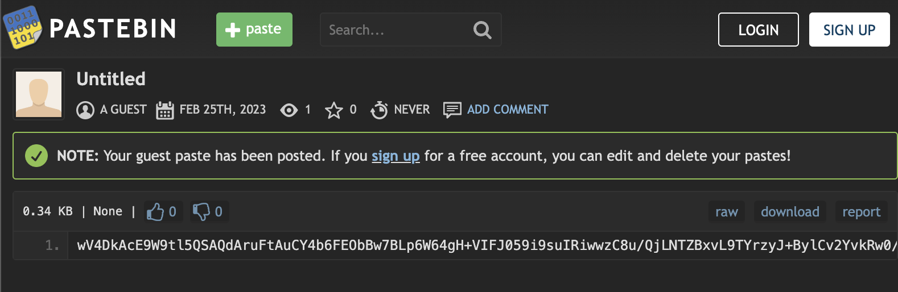
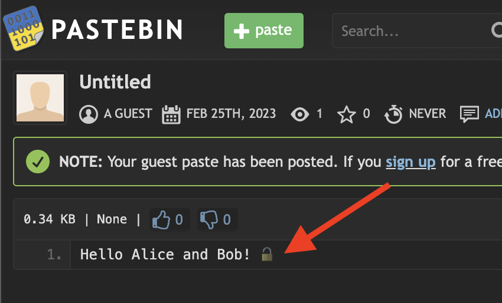
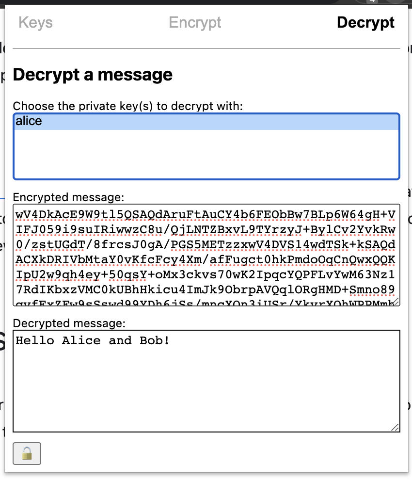

# EncryptAway

## A chrome extension to easily add encryption anywhere on the web

This Chrome extension uses PGP for encryption

1. First, create a KeyPair in the `Keys` tab

1. Share your public key with anyone who will send you a message by using the Export button on the PUBLIC Key
1. Encrypt text using the `Encrypt` tab

Select which recipients can read it from your list of public keys. It can be one or many.
1. Post the text somewhere where your recipient can see it (a website or something)
1. For most users it will look like this:

1. However, for anyone with the private key, it will look like this (note the 🔓 representing some content was decrypted)

1. You can also use the `Decrypt` tab to decrypt messages manually with any of your private keys

1. The 🔓 on the bottom left will attempt to decrypt any messages on the screen in case new encrypted content was loaded

Todo:

- Passphrases
- Files
- Signatures
